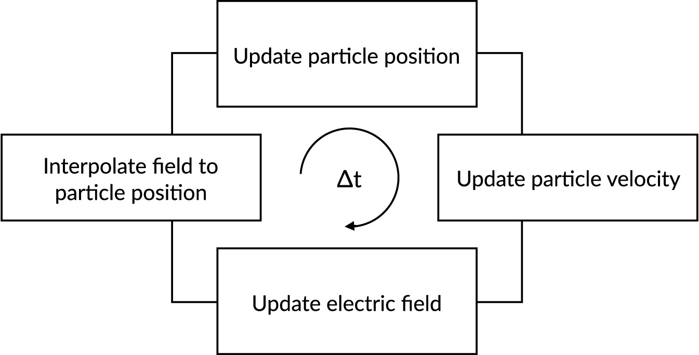
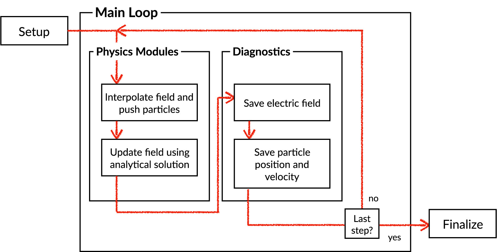

Getting Started
===============

turboPy Conda environment
-------------------------

-   Create a conda environment for turboPy: ``conda env create -f environment.yml``
-   Activate: ``conda activate turbopy``
-   Install turboPy into the environment (from the main folder where ``setup.py`` is):
	- Install turboPy in editable mode (i.e. setuptools "develop mode") if you are modifying turboPy itself: ``pip install -e .``
	- If you just plan to develop a code using the existing turboPy framework: ``pip install .``
-   Run tests: ``pytest``

turboPy development environment
-------------------------------

If using ``pylint`` (which you should!) add ``variable-rgx=[a-z0-9_]{1,30}$`` to your ``.pylintrc`` file to allow single character variable names.

Merge requests are encouraged!

Your first turboPy app
----------------------

The most direct way to try turboPy is to define a
:class:`turbopy.core.PhysicsModule`, register it, and hand a plain
Python dictionary to :class:`turbopy.core.Simulation`.  A TOML input
file is *not* required. ::

    import numpy as np
    from turbopy import PhysicsModule, Simulation

    class HelloModule(PhysicsModule):
        def __init__(self, owner, input_data):
            super().__init__(owner, input_data)
            self.count = 0

        def update(self):
            self.count += 1

    PhysicsModule.register("HelloModule", HelloModule)

    input_data = {
        "Clock": {"start_time": 0.0, "end_time": 1.0, "num_steps": 10},
        "PhysicsModules": {"HelloModule": {}},
    }

    sim = Simulation(input_data)
    sim.run()
    print("Final step count:", sim.physics_modules[0].count)

For a more complete example (a charged particle in an electric field),
see the `particle-in-field
<https://github.com/NRL-Plasma-Physics-Division/particle-in-field>`_
example app.

Running the test suite
----------------------

To run the full test suite::

    pytest

To run a single file, class, or test::

    pytest tests/test_core.py
    pytest tests/test_core.py::TestGrid
    pytest tests/test_core.py::TestGrid::test_r

To collect a coverage report::

    pytest --cov-report=xml --cov=turbopy tests/

Example turboPy app
-------------------

Once you have the turboPy conda environment set up, you can go ahead and write a "turboPy app". The simplest way to get started with writing an app might be to clone an existing example app.

`This example app <https://github.com/NRL-Plasma-Physics-Division/particle-in-field>`_ computes the motion of a charged particle in an electric field.

How the simulation loop drives the app
++++++++++++++++++++++++++++++++++++++

Every turboPy run — including the particle-in-field app — advances
through the same
:meth:`~turbopy.core.Simulation.fundamental_cycle` on each clock tick:
diagnostics fire, each :class:`~turbopy.core.PhysicsModule` is reset
and updated, and the :class:`~turbopy.core.SimulationClock` advances.
See :doc:`simulation_lifecycle` for the full sequence.

   One iteration of the main simulation loop.

Result of the particle-in-field example
+++++++++++++++++++++++++++++++++++++++

Running the particle-in-field app produces the trajectory shown below:
a charged particle oscillating under the influence of a
self-consistent electric field.

   Output of the particle-in-field example app.
