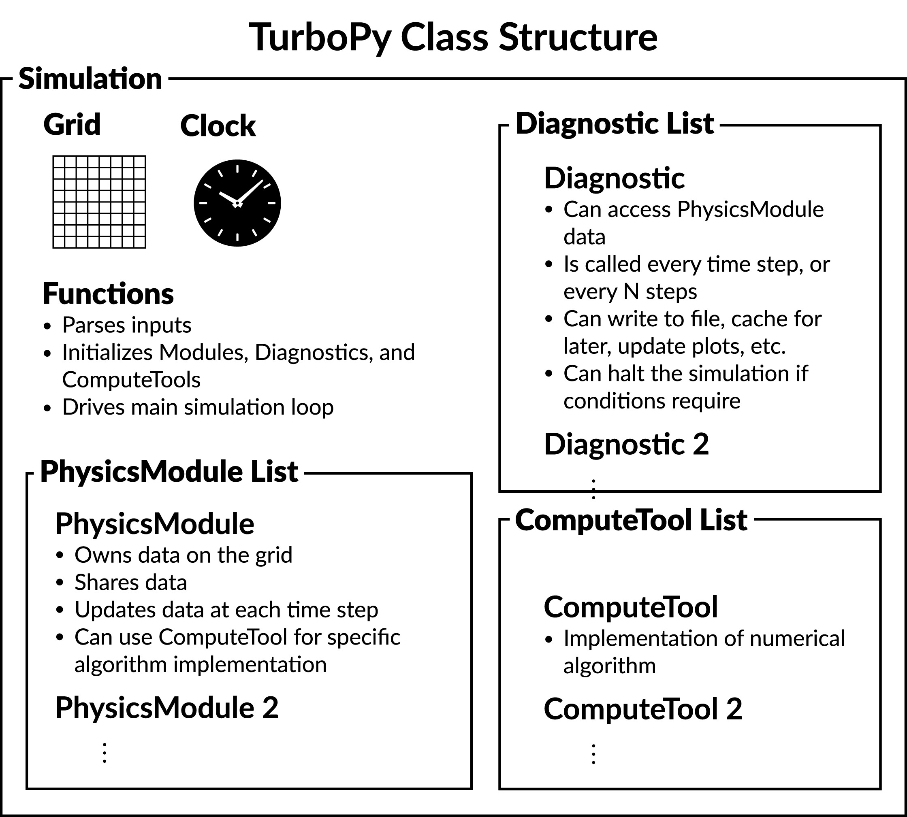

Simulation Lifecycle
====================

The :class:`turbopy.core.Simulation` class is the entry point for every
turboPy run.  Given an input dictionary (or a TOML file — see
:doc:`input_files`), it wires up components, exchanges resources, runs
the main loop, and closes files.

   The :class:`~turbopy.core.Simulation` owns a
   :class:`~turbopy.core.SimulationClock`, a
   :class:`~turbopy.core.GridBase`, and lists of
   :class:`~turbopy.core.PhysicsModule`,
   :class:`~turbopy.core.ComputeTool`, and
   :class:`~turbopy.core.Diagnostic` instances.  All three of the
   latter are registered through the :class:`~turbopy.core.DynamicFactory`
   pattern (see :doc:`dynamic_factory`).

Top-level flow: ``Simulation.run()``
------------------------------------

:meth:`turbopy.core.Simulation.run` performs three steps in order:

1. :meth:`~turbopy.core.Simulation.prepare_simulation` — read input,
   construct all objects, exchange resources, initialize.
2. The main loop — call
   :meth:`~turbopy.core.Simulation.fundamental_cycle` while
   :meth:`turbopy.core.SimulationClock.is_running` returns ``True``.
3. :meth:`~turbopy.core.Simulation.finalize_simulation` — call
   :meth:`~turbopy.core.Diagnostic.finalize` on each diagnostic.

Wall-clock time for the entire :meth:`~turbopy.core.Simulation.run` is
recorded in :attr:`~turbopy.core.Simulation.wall_time`.

Preparation phase
-----------------

:meth:`~turbopy.core.Simulation.prepare_simulation` runs the following
substeps, in the exact order shown:

1. :meth:`~turbopy.core.Simulation.read_grid_from_input` — dispatches on
   the ``"coordinate_system"`` key inside the ``"Grid"`` input dict.
   ``"cartesian2d"`` -> :class:`~turbopy.core.Grid2DCartesian`,
   ``"cylindrical2d"`` -> :class:`~turbopy.core.Grid2DCylindrical`,
   anything else -> the 1D :class:`~turbopy.core.Grid`.
   If there is no ``"Grid"`` key at all, a warning is emitted and the
   simulation runs gridless (``self.grid`` stays ``None``).
2. :meth:`~turbopy.core.Simulation.read_clock_from_input` — constructs a
   :class:`~turbopy.core.SimulationClock` from the ``"Clock"`` dict.
3. :meth:`~turbopy.core.Simulation.read_tools_from_input` — for each key
   in ``input_data["Tools"]``, looks up the class in the
   :class:`~turbopy.core.ComputeTool` registry and instantiates it.  A
   value that is a *list* of dicts creates multiple instances of the
   same tool; each dict may set ``"custom_name"`` so they can be
   distinguished with
   :meth:`~turbopy.core.Simulation.find_tool_by_name`.
4. :meth:`~turbopy.core.Simulation.read_modules_from_input` — for each
   key in ``input_data["PhysicsModules"]``, looks up the class in the
   :class:`~turbopy.core.PhysicsModule` registry and instantiates it,
   then calls :meth:`~turbopy.core.Simulation.sort_modules` (currently
   a stub).
5. :meth:`~turbopy.core.Simulation.read_diagnostics_from_input` — splits
   the ``"Diagnostics"`` dict into (a) entries whose key is a registered
   diagnostic name (via
   :meth:`~turbopy.core.DynamicFactory.is_valid_name`) and (b) other
   entries which are treated as default parameters applied to every
   constructed diagnostic.  Missing ``"filename"`` values are filled in
   as ``"{diag_type}{file_num}.{output_type}"``, and the default output
   directory is ``"default_output"``.
6. Initialize compute tools — call
   :meth:`~turbopy.core.ComputeTool.initialize` on each.
7. Initialize physics modules in three passes:
   :meth:`~turbopy.core.PhysicsModule.exchange_resources` (publishes
   resources to :attr:`~turbopy.core.Simulation.all_shared_resources`),
   then :meth:`~turbopy.core.PhysicsModule.inspect_resources` (each
   module binds its ``_needed_resources``), then
   :meth:`~turbopy.core.PhysicsModule.initialize`.
8. Initialize diagnostics: first
   :meth:`~turbopy.core.Diagnostic.inspect_resources` on each, then
   :meth:`~turbopy.core.Diagnostic.initialize`.

Fundamental cycle
-----------------

The main loop calls :meth:`~turbopy.core.Simulation.fundamental_cycle`
until the clock stops.  A single cycle does, in order:

1. :meth:`~turbopy.core.Diagnostic.diagnose` on each diagnostic.
2. :meth:`~turbopy.core.PhysicsModule.reset` on each module.
3. :meth:`~turbopy.core.PhysicsModule.update` on each module.
4. :meth:`turbopy.core.SimulationClock.advance`.

Because diagnostics run *before* the physics update, the very first
call sees the initial state, and the very last call is issued from
:meth:`~turbopy.core.Diagnostic.finalize` after the loop exits (see the
built-in diagnostics in :doc:`diagnostics`).

Finalization
------------

:meth:`~turbopy.core.Simulation.finalize_simulation` simply calls
:meth:`~turbopy.core.Diagnostic.finalize` on each diagnostic.  This is
where most diagnostics flush buffers to disk.

Running from a dict versus a TOML file
--------------------------------------

Two equivalent entry points::

    from turbopy import Simulation
    sim = Simulation(input_data)
    sim.run()

or::

    from turbopy import construct_simulation_from_toml
    sim = construct_simulation_from_toml("my_input.toml")
    sim.run()

See :doc:`input_files` for the accepted dict/TOML structure.
